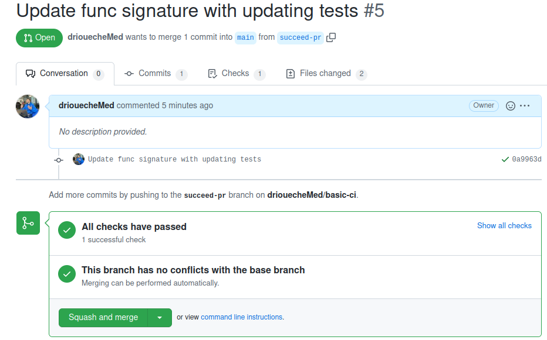
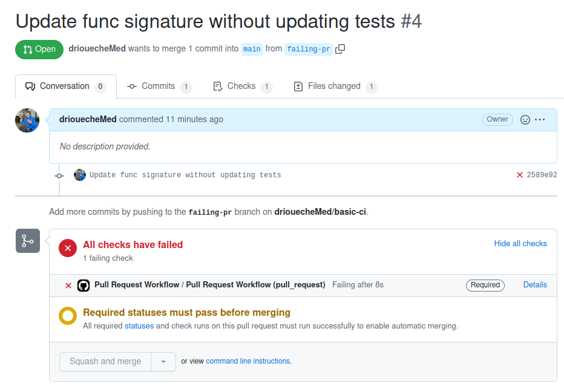

# basic-ci

Continuous integration (CI) workflows demo directly in GitHub repository with GitHub Actions.

This workflow will install Python dependencies, run cover tests and lint with code on each pull request.

## Results

- PR Succeeds: https://github.com/driouecheMed/basic-ci/pull/5

- PR Fails: https://github.com/driouecheMed/basic-ci/pull/4

## Ressources

- The Basics of YAML in Under 5 Minutes: https://www.youtube.com/watch?v=0fbnyS_lHW4

- What can be done with GitHub Actions *(Tuto/Docs Links)*: https://docs.github.com/en/actions/learn-github-actions/understanding-github-actions#next-steps
